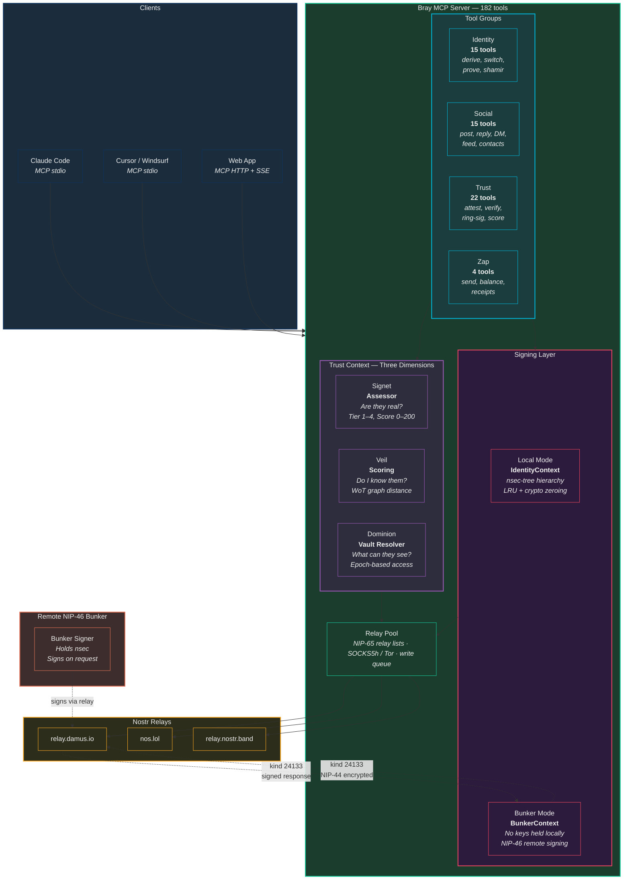
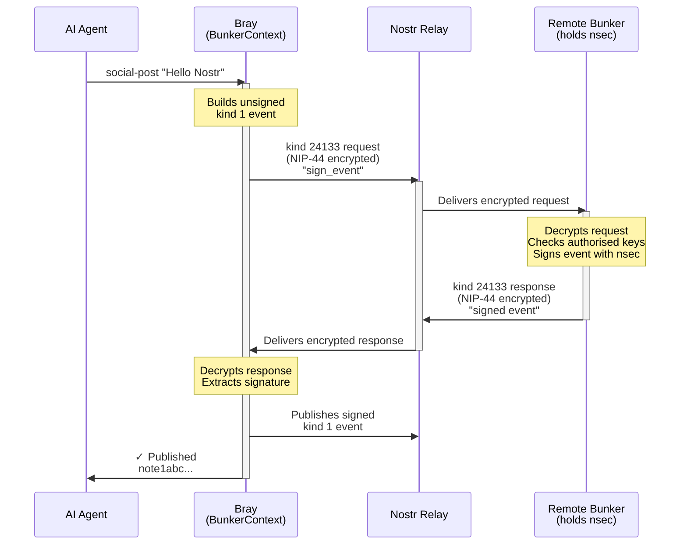
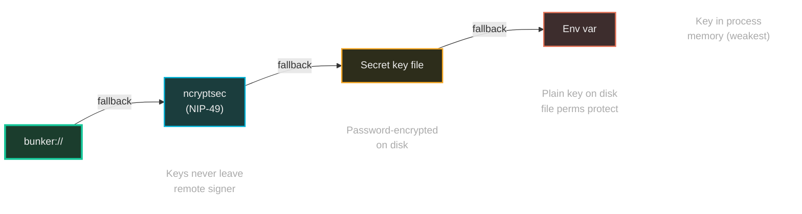

# Bray — Architecture

## System Context

How Bray fits into the Nostr ecosystem — AI agents and humans get sovereign identities with three-dimensional trust.

## NIP-46 Bunker Flow

The remote signing protocol — private keys never leave the bunker.

## Dependency Stack

Bray's library dependencies and what they provide.

```mermaid
graph BT
    subgraph primitives["Cryptographic Primitives"]
        direction LR
        RING["@forgesworn/ring-sig<br/><i>SAG ring signatures<br/>on secp256k1</i>"]
        SHAMIR["@forgesworn/shamir-words<br/><i>Shamir Secret Sharing<br/>BIP-39 output</i>"]
    end

    subgraph identity["Identity Stack"]
        direction LR
        NSEC["nsec-tree<br/><i>Hierarchical identity<br/>derivation</i>"]
        SPOKEN["spoken-token<br/><i>HMAC spoken<br/>verification</i>"]
        CANARY["canary-kit<br/><i>Duress detection</i>"]
    end

    subgraph trust_libs["Trust Stack"]
        direction LR
        SIGNET["signet-protocol<br/><i>Verification credentials<br/>Tier 1–4</i>"]
        DOMINION["dominion-protocol<br/><i>Epoch-based encrypted<br/>access control</i>"]
        VEIL_LIB["nostr-veil<br/><i>Web-of-trust<br/>graph scoring</i>"]
        ATTEST["nostr-attestations<br/><i>NIP-VA kind 31000<br/>attestation builders</i>"]
    end

    subgraph nostr["Nostr Foundation"]
        direction LR
        NT["nostr-tools<br/><i>Events, signing, encryption<br/>NIP-17/44/04, relay pool</i>"]
    end

    subgraph mcp["MCP Framework"]
        direction LR
        MCP_SDK["@modelcontextprotocol/sdk<br/><i>Server framework<br/>stdio + HTTP transport</i>"]
    end

    BRAY["<b>BRAY</b><br/><i>182 tools · 17 groups</i>"]

    NT --> NSEC
    NT --> SIGNET
    NT --> DOMINION
    NT --> VEIL_LIB
    NT --> ATTEST

    RING --> NSEC
    SHAMIR --> NSEC
    CANARY --> SPOKEN

    NSEC --> BRAY
    SPOKEN --> BRAY
    CANARY --> BRAY
    SIGNET --> BRAY
    DOMINION --> BRAY
    VEIL_LIB --> BRAY
    ATTEST --> BRAY
    RING --> BRAY
    SHAMIR --> BRAY
    NT --> BRAY
    MCP_SDK --> BRAY

    style primitives fill:#2d2d1b,stroke:#f5a623,color:#eee,stroke-width:2px
    style identity fill:#1b3d2d,stroke:#16c79a,color:#eee,stroke-width:2px
    style trust_libs fill:#2d2d3d,stroke:#9b59b6,color:#eee,stroke-width:2px
    style nostr fill:#1b2d3d,stroke:#0f3460,color:#eee,stroke-width:2px
    style mcp fill:#1b3d3d,stroke:#00b4d8,color:#eee,stroke-width:2px

    style RING fill:#2d2d1b,stroke:#f5a623,color:#eee
    style SHAMIR fill:#2d2d1b,stroke:#f5a623,color:#eee
    style NSEC fill:#1b3d2d,stroke:#16c79a,color:#eee
    style SPOKEN fill:#1b3d2d,stroke:#16c79a,color:#eee
    style CANARY fill:#1b3d2d,stroke:#16c79a,color:#eee
    style SIGNET fill:#2d2d3d,stroke:#9b59b6,color:#eee
    style DOMINION fill:#2d2d3d,stroke:#9b59b6,color:#eee
    style VEIL_LIB fill:#2d2d3d,stroke:#9b59b6,color:#eee
    style ATTEST fill:#2d2d3d,stroke:#9b59b6,color:#eee
    style NT fill:#1b2d3d,stroke:#0f3460,color:#eee
    style MCP_SDK fill:#1b3d3d,stroke:#00b4d8,color:#eee
    style BRAY fill:#3d2d2d,stroke:#e17055,color:#eee,stroke-width:3px
```

## Auth Tier Progression

From most secure to least — how Bray loads key material.

